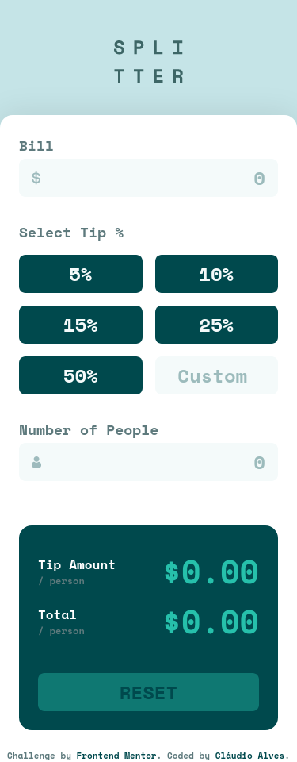

# Frontend Mentor - Tip calculator app solution

This is a solution to the [Tip calculator app challenge on Frontend Mentor](https://www.frontendmentor.io/challenges/tip-calculator-app-ugJNGbJUX). Frontend Mentor challenges help you improve your coding skills by building realistic projects.

## Table of contents

- [Overview](#overview)
  - [The challenge](#the-challenge)
  - [Screenshot](#screenshot)
  - [Links](#links)
- [My process](#my-process)
  - [Built with](#built-with)
  - [What I learned](#what-i-learned)
  - [Continued development](#continued-development)
- [Author](#author)

## Overview

### The challenge

Users should be able to:

- View the optimal layout for the app depending on their device's screen size
- See hover states for all interactive elements on the page
- Calculate the correct tip and total cost of the bill per person 

### Screenshot





### Links

- [Solution](https://www.frontendmentor.io/solutions/tip-calculator-app-build-w-vanilla-js-and-sass-3QueWBRYGx)
- [Demo](https://claudioalvesmachado.github.io/tip-calculator-app/)

## My process

### Built with

- Semantic HTML5 markup
- SASS/SCSS
- Flexbox
- CSS Grid
- Mobile-first workflow
- Vanilla Javascript


### What I learned

I learned to use the ``` forEach() ``` method to select the buttons separately, and thus, make my code smaller and simpler, like this:

```js
tips.forEach((/**/) => {
        if (/**/) {
          ////////
        }
})
```

### Continued development

After completing this challenge, I was interested in learning a lot more about interactivity using javascript to make my projects more professional and functional.


## Author


- Frontend Mentor - [@claudioalvesmachado](https://www.frontendmentor.io/profile/claudioalvesmachado)
- Linkedin - [Cláudio Alves](https://www.linkedin.com/in/mlvgns/)
